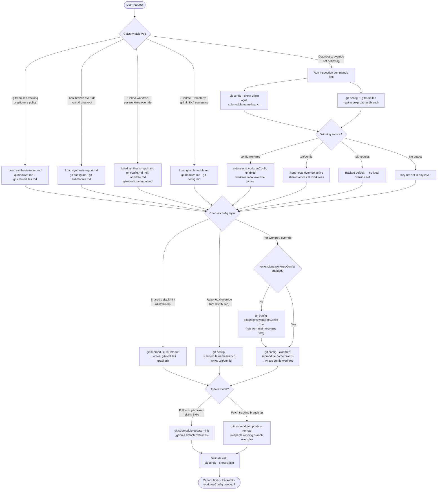

# git-submodules
A Claude skill covering Git's supported submodule configuration model in depth — specifically the three-layer config precedence (tracked `.gitmodules`, repo-local `.git/config`, and worktree-local `config.worktree`), how `git submodule update --remote` differs from `update --init`, and how linked worktrees can carry independent submodule branch overrides via `extensions.worktreeConfig`. The bundled corpus (snapshot: 2026-03-21) includes verbatim Git man-page captures plus a synthesis report with decision rules and a quick-reference cheat sheet.

## Install

The fastest cross-agent install path is the `skills` CLI:

```bash
npx skills add gg-skills/git-submodules
```

Drop this skill into a workspace as a Git submodule for pinned versions, or as a plain clone for latest `main`:

```bash
# Project-local, version-pinned:
git submodule add git@github.com:gg-skills/git-submodules.git .claude/skills/git-submodules

# OR project-local, latest main:
mkdir -p .claude/skills
git -C .claude/skills clone git@github.com:gg-skills/git-submodules.git

# OR user-level, available in every project on this machine:
mkdir -p ~/.claude/skills
git -C ~/.claude/skills clone git@github.com:gg-skills/git-submodules.git
```

Restart your agent or reload skills after installation. See the parent [`skills` catalog repo](https://github.com/gg-skills/skills) for the full catalog.

## When to use

- Questions about `.gitmodules` tracking, gitignore policy, or config layer precedence.
- A submodule branch override is not behaving as expected and the cause is unclear.
- A repo uses linked worktrees and needs per-worktree submodule branch state.
- Understanding `git submodule update --remote` vs gitlink SHA semantics.
- Migrating a repo away from tracked `.gitmodules` branch drift.

Skip this skill for basic `git clone --recurse-submodules` or straightforward `git submodule add` questions covered by `git submodule --help`. Also skip it when the task is about applying these rules to a specific repo's prepared-worktree workflow — consult that repo's skill instead.

## How it operates

### Inputs

The skill reads three on-disk sources, in precedence order from highest to lowest:

| Source | Path | Contains |
|--------|------|----------|
| Worktree-local config | `$(git rev-parse --git-path config.worktree)` — resolves to e.g. `.git/worktrees/<id>/config.worktree` for linked worktrees, or `.git/config.worktree` for the main worktree when enabled | Per-worktree `submodule.<name>.branch` overrides; only active when `extensions.worktreeConfig = true` |
| Repo-local config | `.git/config` | Repo-local `submodule.<name>.branch` overrides; shared across all worktrees of the same repo |
| Tracked manifest | `.gitmodules` | Canonical `submodule.<name>.path`, `.url`, and (optionally) `.branch` — committed and distributed with the superproject |

The effective value for any `submodule.<name>.branch` key is the first hit in that order. Example: if `.git/config` sets `submodule.lib.branch = stable` and `.gitmodules` sets `branch = main`, Git uses `stable`.

### Outputs

The skill produces two types of output:

1. **Config edits** — explicit `git config` command invocations that write to one of the three layers above. No file is modified directly; every write goes through `git config`.
2. **Command guidance** — shell commands with annotated side effects. Each recommended command is accompanied by an explanation of which layer it touches and what it does not affect.

### External commands

| Command | What it does |
|---------|-------------|
| `git config -f .gitmodules --get-regexp '^submodule\..*\.(path\|url\|branch)$'` | Reads the tracked manifest directly, bypassing config precedence |
| `git config --show-origin --get submodule.<name>.branch` | Shows the effective value and which file it came from |
| `git config --show-origin --get-regexp '^submodule\..*\.branch$'` | Audits all branch overrides and their sources across all layers |
| `git config submodule.<name>.branch <branch>` | Writes a repo-local override to `.git/config` |
| `git config extensions.worktreeConfig true` | Enables the worktree-config split; must run from the main worktree |
| `git config --worktree submodule.<name>.branch <branch>` | Writes a worktree-local override to `config.worktree`; requires `extensions.worktreeConfig = true` |
| `git rev-parse --git-path config.worktree` | Resolves the portable path to the active worktree's config file |
| `git submodule set-branch --branch <branch> -- <path>` | Writes a branch hint to tracked `.gitmodules` (distributed, not local) |
| `git submodule update --init -- <path>` | Checks out the commit recorded in the superproject gitlink; ignores `submodule.<name>.branch` |
| `git submodule update --remote -- <path>` | Fetches and checks out the tip of the tracking branch; respects `submodule.<name>.branch` from the winning config layer |

### Side effects

- `git config submodule.<name>.branch` modifies `.git/config`, which is local and not tracked.
- `git config --worktree submodule.<name>.branch` modifies the worktree-specific `config.worktree` file, which is also local and not tracked. Both files are always gitignored.
- `git submodule set-branch` modifies `.gitmodules`, which IS tracked — changes propagate to all collaborators on next push/pull.
- `git submodule update --remote` advances the submodule HEAD and, if the caller stages the updated gitlink, changes the superproject's recorded commit for that submodule.
- Enabling `extensions.worktreeConfig` splits the main worktree's config from linked-worktree configs; this is a one-way structural change that affects all future `git config --worktree` calls in the repo.

### Mode toggles: `.git/config` vs `config.worktree`

When `extensions.worktreeConfig` is **disabled** (the default), `.git/config` is the only repo-local layer. All worktrees of the same repo share the same `submodule.<name>.branch` values — there is no per-worktree override possible.

When `extensions.worktreeConfig` is **enabled**, Git splits the repo-local layer: settings written with `--worktree` go into each worktree's own `config.worktree`, while settings without `--worktree` continue to go into `.git/config` (shared). This allows worktree A to track `feature-x` and worktree B to track `main` for the same submodule simultaneously.

Verify after enabling:

```bash
# Enable in the main worktree:
git config extensions.worktreeConfig true

# Confirm the override landed in config.worktree, not .git/config:
git config --show-origin --get submodule.<name>.branch
```

## Operational flow



## Layout

```
.
├── SKILL.md                  ← entry point: workflow, misconceptions, policy, command guide
├── agents/
│   └── openai.yaml           ← agent/IDE descriptor
├── assets/                   ← skill icons
└── references/               ← local corpus (curated + verbatim man-page captures)
    ├── quick-reference.md    ← inspection commands and config scope cheat sheet
    ├── snapshot.md           ← corpus overview: what is captured, when, topic navigation
    ├── synthesis-report.md   ← synthesized analysis of config patterns and decision rules
    ├── update-workflow.md    ← how to refresh the corpus when Git docs change
    ├── gitmodules.md         ← verbatim man page: .gitmodules format and required keys
    ├── gitsubmodules.md      ← verbatim man page: submodule concepts and superproject model
    ├── git-submodule.md      ← verbatim man page: update --remote, set-branch, init
    ├── git-config.md         ← verbatim man page: config scopes, submodule vars, extensions.worktreeConfig
    ├── git-worktree.md       ← verbatim man page: linked worktrees, config --worktree, rev-parse --git-path
    └── gitrepository-layout.md ← verbatim man page: on-disk layout including .git/worktrees/<id>/
```

## Quick start

[`SKILL.md`](SKILL.md) is the entry point — it carries the task classification workflow, a reference-file router, explicit command examples for every scenario, and non-negotiable policy.

For diagnostic requests, run inspection commands before loading any reference files:

```bash
# Inspect the tracked manifest
git config -f .gitmodules --get-regexp '^submodule\..*\.(path|url|branch)$'

# Inspect the effective winning value and its source
git config --show-origin --get submodule.<name>.branch

# Set a repo-local branch override
git config submodule.<name>.branch <branch>

# Enable worktree-local config and set a per-worktree override
git config extensions.worktreeConfig true
git config --worktree submodule.<name>.branch <branch>
git rev-parse --git-path config.worktree      # portable path to worktree config
```

Load reference files by task type (see the router in SKILL.md). For routine lookups, `references/quick-reference.md` is first; `references/synthesis-report.md` covers decision rules; the verbatim man pages are the primary source for exact behavior.

## Resources

- [SKILL.md](SKILL.md) — full workflow, command decision guide, misconceptions, policy
- [agents/openai.yaml](agents/openai.yaml) — agent/IDE descriptor
- [references/](references/) — 10 reference files (4 curated + 6 verbatim man-page captures)
- [assets/](assets/) — skill icons

## Caveats

- **Do not gitignore `.gitmodules` to hide branch changes** — `.gitmodules` is required for submodule bootstrap on fresh clones. Hiding it breaks initialization. Move branch intent into `.git/config` or `config.worktree` and keep `.gitmodules` tracked for path and URL data.
- **`git submodule set-branch` writes to tracked `.gitmodules`** — it is a tool for setting a shared default hint, not for per-worktree or per-checkout overrides. For hidden local state, use `git config submodule.<name>.branch` or `git config --worktree`.
- **Branch overrides only affect `update --remote`** — `submodule.<name>.branch` overrides do not change the commit checked out by `git submodule update --init`. That command always follows the superproject gitlink SHA.
- **`git config --worktree` silently falls back to `.git/config` when `extensions.worktreeConfig` is not enabled** — always verify with `git config --show-origin` after setting a worktree-scoped value.
- **Never hardcode `.git/worktrees/<id>/config.worktree` in scripts** — use `git rev-parse --git-path config.worktree` for portable resolution; the worktree ID is an implementation detail.
